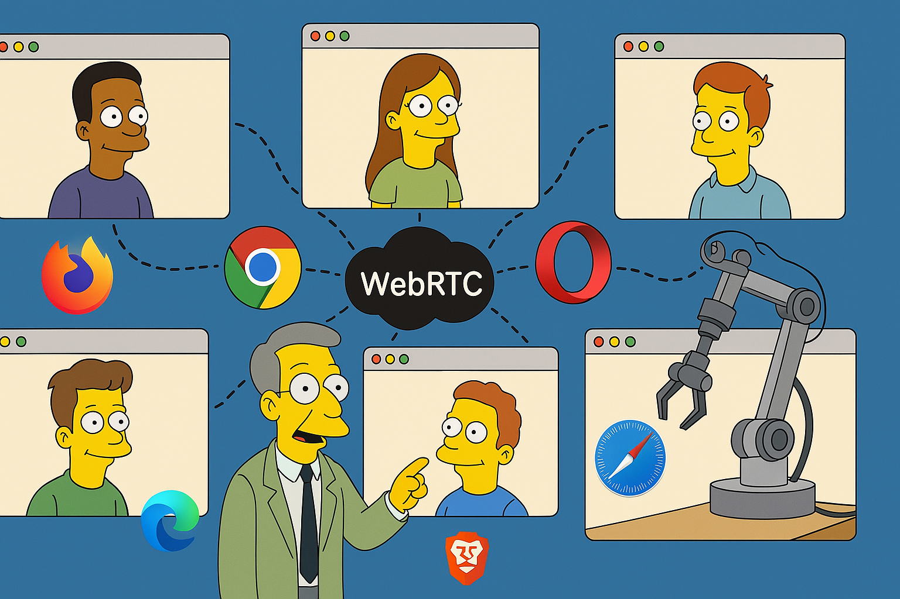
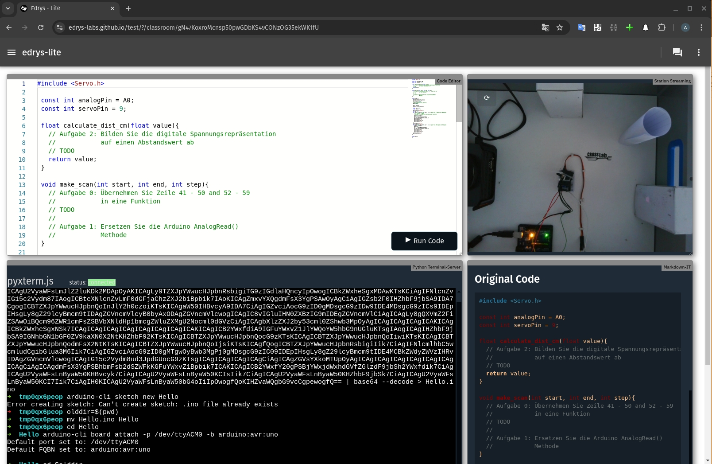
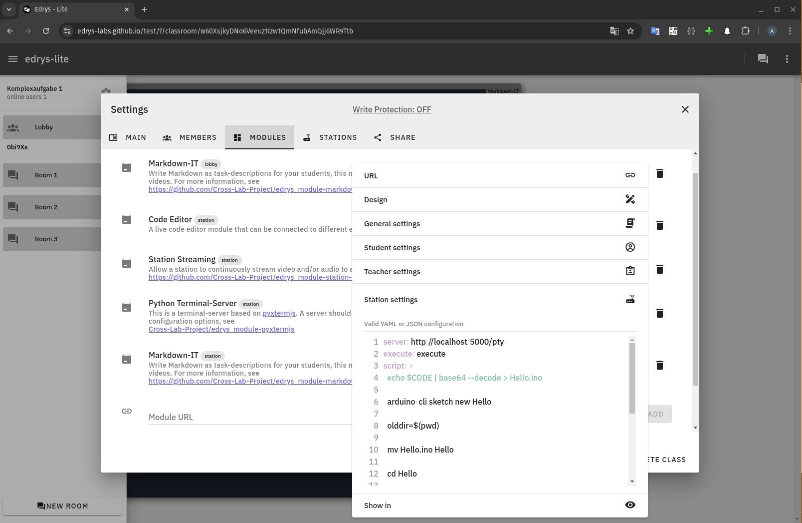
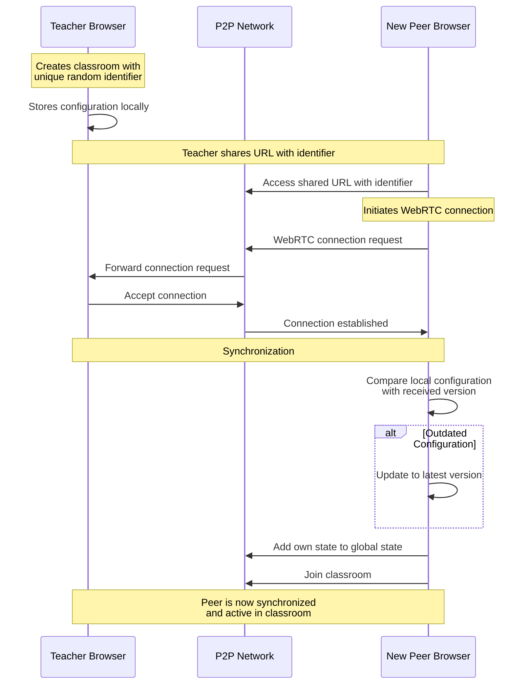
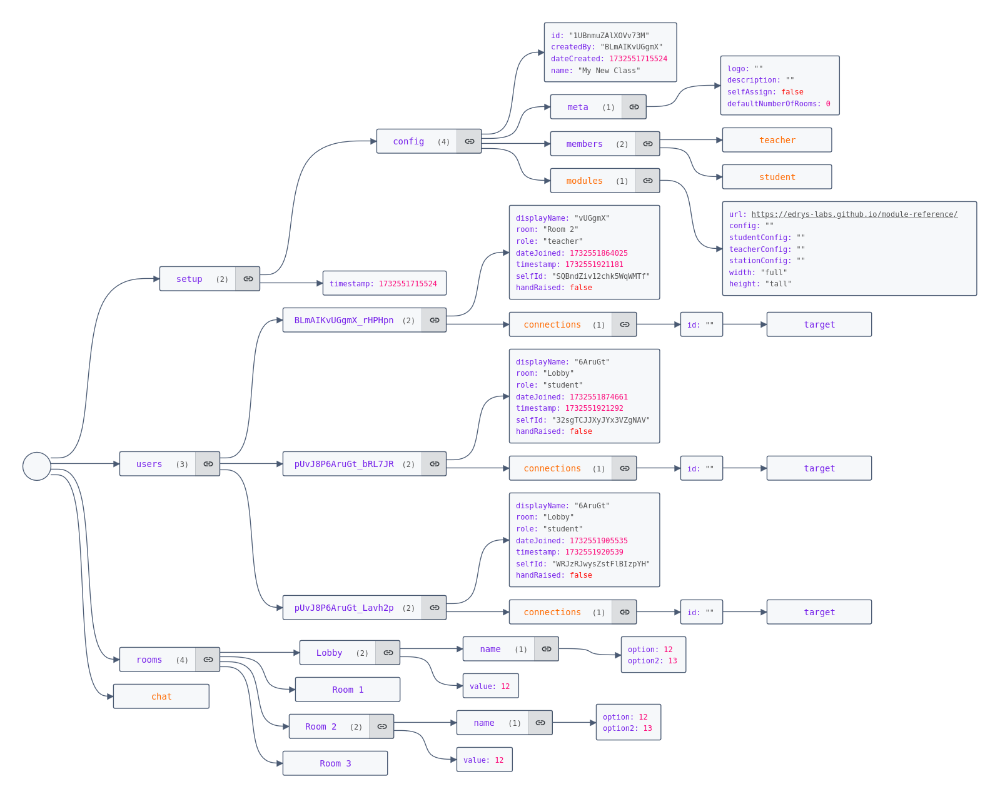

<!--
author:   André Dietrich; Sebastian Zug; Ines Aubel; Jihad Hyadi1

email:    andre.dietrich@informatik.tu-freiberg.de

version:  0.0.1

language: en

narrator: US English Female

icon:     image/crosslab.png

comment:  Remote laboratories have become essential in modern education and research, enabling remote access to experimental setups. However, traditional server-based architectures present challenges in scalability, cost, and resilience. This presentation introduces edrys-Lite, a browser-based, peer-to-peer remote laboratory platform that leverages WebRTC for real-time communication and Yjs for distributed stat

tags:       Remote Labs, Peer-to-Peer, Serverless, WebRTC, Yjs, Distributed Systems, Real-time Collaboration

import: https://raw.githubusercontent.com/liaScript/mermaid_template/master/README.md

@load
<script style="display: block" modify="false" run-once="true">
    fetch("@2")
    .then((response) => {
        if (response.ok) {
            response.text()
            .then((text) => {
                send.lia("LIASCRIPT:\n```` @0 @1\n" + text + "\n````")
            })
        } else {
            send.lia("HTML: <span style='color: red'>Something went wrong, could not load <a href='@2'>@1</a></span>")
        }
    })
    "loading: @1"
</script>
@end

@WebSerial
<script>
(async function() {
  // Check if the Web Serial API is supported.
  if (!("serial" in navigator)) {
    console.error("Web Serial API is not supported in this browser.");
    return;
  }

  // Declare connection-related variables for later cleanup.
  let port = null;
  let reader = null;

  try {
    // Request and open the serial port.
    port = await navigator.serial.requestPort();
    await port.open({ baudRate: 115200 });

    // Create a TextEncoder instance.
    const encoder = new TextEncoder();
    // Function to stop any currently running code by sending Ctrl-C.
    async function stopCurrentProgram() {
      try {
        const writer = port.writable.getWriter();
        // Send Ctrl-C (ASCII 0x03) to interrupt any running code.
        await writer.write(encoder.encode("\x03"));
        // Wait briefly to allow the interrupt to be processed.
        await new Promise(resolve => setTimeout(resolve, 100));
        // Send a second Ctrl-C in case the first one was missed.
        await writer.write(encoder.encode("\x03"));
        writer.releaseLock();
      } catch (e) {
        console.error("Error sending Ctrl-C:", e);
      }
    }

    // Stop any running code before sending new code.
    await stopCurrentProgram();

    // Retrieve the entire Python code from the liascript input.
    const pythonCode = `@input(0)`;

    // Function to send code using MicroPython's paste mode.
    // In paste mode, the REPL buffers all lines until Ctrl‑D is received,
    // then it compiles and executes the entire code block at once.
    async function sendCodeInPasteMode(code) {
      const writer = port.writable.getWriter();
      // Enter paste mode (Ctrl‑E, ASCII 0x05).
      await writer.write(encoder.encode("\x05"));
      // Wait briefly for paste mode to be activated.
      await new Promise(resolve => setTimeout(resolve, 100));

      // Split the code into lines, preserving all indentation.
      const codeLines = code.split(/\r?\n/);
      for (const line of codeLines) {
        // Send each line exactly as-is, with CR+LF.
        await writer.write(encoder.encode(line + "\r\n"));
      }
      // Exit paste mode by sending Ctrl‑D (ASCII 0x04).
      await writer.write(encoder.encode("\x04"));
      writer.releaseLock();
      send.lia("LIA: terminal");
    }

    // Function that sends the code and reads output until the REPL prompt (">>>") is detected.
    // This ensures the entire block is executed before further input is allowed.
    async function sendCodeAndWaitForPrompt(code) {
      await sendCodeInPasteMode(code);
      let outputBuffer = "";
      const tempReader = port.readable.getReader();
      const decoder = new TextDecoder();
      let promptFound = false;

      while (!promptFound) {
        const { value, done } = await tempReader.read();
        if (done) break;
        if (value) {
          const text = decoder.decode(value);
          outputBuffer += text;
          console.stream(text);
          // Look for the REPL prompt (adjust if your prompt differs).
          if (outputBuffer.includes(">>>")) {
            promptFound = true;
          }
        }
      }
      await tempReader.releaseLock();
      return outputBuffer;
    }

    // Send the Python code and wait until the prompt is detected.
    await sendCodeAndWaitForPrompt(pythonCode);
    console.log("Python code executed and prompt detected.");

    // Now that execution is complete, enable terminal input.
    send.lia("LIA: terminal");

    // Start a global read loop to capture and display subsequent output.
    reader = port.readable.getReader();
    const globalDecoder = new TextDecoder();
    (async function readLoop() {
      try {
        while (true) {
          const { value, done } = await reader.read();
          if (done) {
            console.debug("Stream closed");
            send.lia("LIA: stop");
            break;
          }
          if (value) {
            console.stream(globalDecoder.decode(value));
          }
        }
      } catch (error) {
        console.error("Read error:", error);
      } finally {
        try { reader.releaseLock(); } catch (e) { /* ignore */ }
      }
    })();

    // Handler to send terminal input lines to MicroPython.
    send.handle("input", input => {
      (async function() {
        try {
          const writer = port.writable.getWriter();
          // Send the terminal input (preserving any whitespace) with CR+LF.
          await writer.write(encoder.encode(input + "\r\n"));
          writer.releaseLock();
        } catch (e) {
          console.error("Error sending input to MicroPython:", e);
        }
      })();
    });

    // Handler to clean up all connections and variables when a "stop" command is received.
    send.handle("stop", async () => {
      console.log("Cleaning up connections and stopping execution.");

      // Cancel the reader if it exists.
      if (reader) {
        try {
          await reader.cancel();
        } catch (e) {
          console.error("Error canceling reader:", e);
        }
        try { reader.releaseLock(); } catch (e) { /* ignore */ }
      }

      // Close the serial port if it's open.
      if (port) {
        try {
          await port.close();
        } catch (e) {
          console.error("Error closing port:", e);
        }
      }

      // Reset connection variables.
      port = null;
      reader = null;
      console.log("Cleanup complete.");
    });

  } catch (error) {
    console.error("Error connecting to the MicroPython device:", error);
    send.lia("LIA: stop");
  }
})();

"LIA: wait"
</script>
@end

-->

# Edrys-Lite – Shareable Peer-to-Peer Remote Labs

Using Only Browser Technologies
===============================

------------------------------------------------------



------------------------------------------------------

TU Bergakademie Freiberg, Germany
---------------------------------

___André Dietrich, Sebastian Zug, Ines Aubel, Jihad Hyadi___


------------------------------------------------------

Contact: andre.dietrich@informatik.tu-freiberg.de

## 1. Introduction

    --{{0}}--
Modern web browsers have evolved into powerful platforms, effectively becoming the new operating systems of the web era. This evolution opens up exciting possibilities, such as leveraging browser capabilities to share remote laboratories. Today’s browsers offer a wide array of APIs that enable direct access to various sensors (e.g., odometry, GPS, gyroscope) and local hardware through technologies like WebUSB and WebSerial.
!?[▶️](video/speaker_1.webm)

``` python
from microbit import *

# Display a scrolling message
display.scroll("Hello edrys!")

# Read the temperature
temp = temperature()
print("Temperature:", temp)

# Display a heart on the LED matrix
display.show(Image.HEART)
```
@WebSerial

<center><div style="resize: both; overflow: auto; min-height: 240px; min-width: 320px; border: 1px solid #ccc; padding: 0; margin-bottom: 10px; display: flex; justify-content: center; align-items: center;"><video autoplay="false" id="videoElement" style="display: none; max-width: 100%; max-height: 100%; object-fit: contain;"></video></div></center>

<script input="submit" default="Open Camera">
const video = document.querySelector("#videoElement")

if (video.srcObject === null) {
    if (navigator.mediaDevices.getUserMedia) {
        navigator.mediaDevices.getUserMedia({ video: true })
            .then(function (stream) {
                video.srcObject = stream
                video.style.display = "block"
                send.lia("Close Camera")
            })
            .catch(function (error) {
                console.log("Something went wrong!")
                send.lia("Camera Problem")
            });

        send.output("Waiting for Camera")
        "LIA: wait"
    } else {
        "No Camera connected"
    }
} else {
    const tracks = video.srcObject.getTracks()
    // Stop all tracks
    tracks.forEach(track => track.stop())
    video.style.display = "none"
    video.srcObject = null
    "Open Camera"
}
</script>

    --{{1}}--
Additionally, modern browsers support offline usage by allowing websites to be installed locally, extensively support different caching strategies, and provide built-in databases for data storage, such as IndexedDB. Moreover, since the introduction of WebRTC in 2011, it has been possible to establish direct peer-to-peer communication between browsers, facilitating real-time data exchange without intermediary servers.
!?[▶️](video/speaker_2.webm)

      {{1}}
- Offline support for WebSites (Progressive Web Apps)
- Integrated databases (IndexedDB)
- Direct peer-to-peer communication (WebRTC)
- WebGL and WebGPU for 3D graphics and AI applications

    --{{2}}--
Given these advancements, a pertinent question arises: __Do we still need the classical client-server architecture to share laboratories, or can browsers alone suffice?__
!?[▶️](video/speaker_3.webm)

      {{2}}
<!-- style="width: 100%"-->

    --{{3}}--
Traditionally, hosting a server for a remote lab is often cumbersome and complicated. It requires extensive knowledge of web technologies, server configurations, and user management before a remote lab can be effectively shared. Additionally, maintaining a server incurs ongoing costs related to hardware, hosting services, and security measures. By utilizing only browser technologies, it should therefore be possible to run most, if not all, remote lab installations without the need for a dedicated server. Such a serverless approach would significantly reduce both the complexity and cost associated with deploying remote labs.
!?[▶️](video/speaker_4.webm)

      {{3}}
<!-- style="width: 100%"-->

## 2. Challenges

    --{{0}}--
The goal of this project is to explore the feasibility of using only browser technologies to create shareable peer-to-peer remote labs. This includes addressing the challenges associated with peer-to-peer communication, data synchronization, and ensuring a seamless user experience.
!?[▶️](video/speaker_5.webm)

{{1}} __Remote Labs as OER & Open Source__

    --{{1}}--
To lower the barriers for lab developers, it would be beneficial if laboratories—particularly their setups—could be developed as open-source projects and utilized as Open Educational Resources (OER). This approach would promote a human-readable format that is easily extendable and modifiable, fostering a collaborative and accessible environment for educational and research purposes.
!?[▶️](video/speaker_6.webm)

{{2}} __Peer-2-Peer Communication__

    --{{2}}--
!?[▶️](video/speaker_8.webm)
However, transitioning to a serverless model presents its own set of challenges, including ensuring data security, managing peer-to-peer connections reliably, and maintaining synchronization across different user sessions. This paper explores the feasibility of using only browser technologies to create shareable peer-to-peer remote labs, addressing these challenges and demonstrating practical implementations.

{{3}} __Simplicity__

    --{{3}}--
!?[▶️](video/speaker_9.webm)
The goal is to create a simple and easy-to-use solution that allows users to share their remote labs. This simplicity should extend to both the technical implementation and the user experience, making it accessible to a wide range of users, including those with limited technical expertise.

## 3. Concept

    --{{0}}--
While WebRTC serves as a fundamental building block for communication in remote laboratories, several other elements are essential to create and share laboratories via the internet.
!?[▶️](video/speaker_10.webm)

    --{{1}}--
In our approach, we have adopted numerous ideas from Edrys, a self-hosted and open-source online learning platform. Edrys allows educators to create remote classrooms to connect with students and provides students with remote and asynchronous access to their in-person labs.
!?[▶️](video/speaker_11.webm)

      {{1}}
``` ascii
  Students                    Teachers

 🧑🏿‍🎓💻 <---.                  .---> 💻🧑🏻‍🏫 
          |   .----------.   |
 👩🏼‍🎓💻 <---+-> | edrys 🖥️ | <-+---> 💻👨🏿‍🏫 
          |   '----------'   |
 👩🏻‍🎓💻 <---'         A        '---> 💻👩‍🏫 
                    |
              .-----+-----.
              |     |     |
              V     V     V
            🦾💻  🔬💻  ⚗️💻

                Stations
```

    --{{1}}--
As depicted in the figure, Edrys utilizes a central server to manage authentication, lab configuration, and the interconnection of users across three distinct roles: Teachers, Stations, and Students. Teachers manage classroom configurations and can modify settings or add students. Stations are users who share access to locally running hardware or experiments via browser APIs such as Web Serial or WebUSB, or by running a local server that communicates with the website through HTTP requests or WebSockets. Students access shared laboratory resources without additional privileges.
!?[▶️](video/speaker_12.webm)

      {{2}}
``` ascii
       🧑🏿‍🎓💻 <-----> 💻🧑🏻‍🏫
         ^ ^       ^ ^
        /   \     /   \
       /     \   /     \
      v       \ /       v
 👩🏻‍🎓💻 <--------+--------> 💻👩🏻‍🎓
      A       / \       A
       \     /   \     /
        \   /     \   /
         v v       v v
       👩🏼‍🎓💻 <-----> 💻⚗️
```

    --{{2}}--
Our implementation, referred to as edrys-Lite, reimagines this architecture by adopting a decentralized, peer-to-peer (P2P) approach. By leveraging browser technologies like WebRTC, edrys-Lite eliminates the need for a central server, thereby simplifying deployment and reducing operational costs. This serverless model maintains classroom configurations and user interactions directly within the browsers of participating peers, enhancing scalability and resilience.
!?[▶️](video/speaker_13.webm)

### Modularity & Re-Configurability

    --{{0}}--
Edrys offers a flexible method for creating classrooms, where a classroom can consist of multiple rooms, each defined by various configurable modules or components. For example, a room may include an Editor Module, a Terminal Server Module providing access to a local terminal server connected to a programmable Arduino, and a Markdown Module used to present the current task. Each module operates as a self-contained small website, displayed within a secure iframe in the Edrys environment.
!?[▶️](video/speaker_14.webm)

     {{0-1}}


    --{{1}}--
These modules can be configured in terms of design (size), user roles (different user roles are presented with different views), and appearance (different rooms may have different modules). The screenshot depicts the configuration of a classroom: on the left, different rooms are shown (each with only one active user), and in the center, the settings for all included modules are displayed, including the current configuration of the “Python Terminal Server” module.
!?[▶️](video/speaker_15.webm)

     {{1-2}}


    --{{2}}--
Users can explore different modules at the following GitHub link:
!?[▶️](video/speaker_16.webm)

      {{2}}
https://github.com/topics/edrys-module?q=edrys-lite

    --{{3}}--
These modules can be easily integrated by importing an HTTP website or a YAML configuration. Since a classroom is simply a configuration of modules, it is also possible to download the entire configuration as a YAML or JSON text file. These configurations can be shared with others, allowing them to be reused and modified. An overview of some of our tagged classroom configurations is available here.
!?[▶️](video/speaker_17.webm)

      {{3}}
https://github.com/topics/edrys-lab

### Creating & Joining Classrooms

    --{{0}}--
Thus, the entire lab configuration is defined within a single YAML file. It contains a reference to all modules, together with their specific configurations, which also cover design, room visibility, or different settings based on the user role, etc.
!?[▶️](video/speaker_18.webm)

@[load(yaml, -ardunio-experiment.yaml)](laboratory.yaml)

    --{{1}}--
In the original Edrys system a central server was pivotal for maintaining classroom configurations, managing the state (i.e., tracking which users were present in each room), and facilitating message exchanges between users. This centralized approach, while effective, introduced dependencies on server infrastructure for synchronization and communication.
!?[▶️](video/speaker_19.webm)

    --{{1}}--
In our implementation, referred to as edrys-Lite, we adopt a decentralized architecture that leverages peer-to-peer (P2P) technologies to eliminate the need for a central server. When a teacher creates a new classroom in edrys-Lite, the system generates a unique random identifier for the classroom. This identifier is attached to the classroom's URL, which serves as the access point for participants. The classroom configuration is stored locally within the teacher's browser, ensuring that the initial setup remains decentralized.
!?[▶️](video/speaker_20.webm)

{{1}} https://edrys-lite.github.io/?/classroom/UNIQUE-IDENTIFIER

    --{{2}}--
Opening a classroom in edrys-Lite establishes a dynamic chat-room-like environment, where participants can join by accessing the shared URL containing the unique identifier. Upon accessing this URL, peers establish a connection via WebRTC (Web Real-Time Communication), a browser-based P2P communication protocol that enables real-time data exchange directly between browsers without intermediary servers.
!?[▶️](video/speaker_21.webm)

      {{2}}


    --{{3}}--
Once the WebRTC connection is established, the first data exchanged between peers is the classroom configuration. This synchronization process ensures that all participants have the most up-to-date configuration. If a peer possesses an outdated version of the configuration, it is automatically updated to match the latest version provided by the teacher. This mechanism guarantees consistency across all connected peers without relying on a central authority.
!?[▶️](video/speaker_22.webm)

## 4. Implementation (Developer Happieness)

    --{{0}}--
The entire application is a JavaScript-based web application (WebApp) that operates entirely within the browser. The implementation is available on GitHub:
!?[▶️](video/speaker_23.webm)

      {{0}}
https://github.com/edrys-labs/edrys-Lite

    --{{1}}--
And it is also hosted as a static website on GitHub Pages:
!?[▶️](video/speaker_24.webm)

      {{1}}
https://edrys-labs.github.io

### Module Creation

    --{{0}}--
Creating a module involves developing a website that is loaded within an iframe. To integrate a module with the edrys-Lite environment, developers only need to import the Edrys API into the module:
!?[▶️](video/speaker_25.webm)

      {{0}}
``` html
<script src="https://edrys-labs.github.io/module/edrys.js"></script>
```

    --{{1}}--
This script initializes a global `Edrys` object that facilitates communication with the edrys-Lite reactive environment. The operational role of the module is specified using the `Edrys.role` property:
!?[▶️](video/speaker_26.webm)

      {{1}}
``` javascript
Edrys.role = "station"; // or "student" or "teacher"
```

    --{{2}}--
This determines the module's operational state. Additionally, the global module configuration can be accessed and refined based on the current user role:
!?[▶️](video/speaker_27.webm)

      {{2}}
``` javascript
Edrys.module.config; // .teacher | .student | .station
```

    --{{3}}--
The Edrys API provides reactive callbacks to handle state changes:
!?[▶️](video/speaker_28.webm)

      {{3}}
``` javascript
Edrys.onReady(() => {
   // Initial setup
});
Edrys.onUpdate(() => {
  // Handle state changes
});
```

    --{{3}}--
These callbacks enable modules to perform necessary actions upon initialization and when state updates occur, ensuring seamless integration and responsiveness within the edrys-Lite environment.
!?[▶️](video/speaker_29.webm)

### State Management

    --{{0}}--
After loading the classroom configuration, the global state is synchronized across all participants. This global state encompasses all users and room configurations, including existing rooms, user memberships within each room, and chat functionality. Additionally, each room maintains its own state, which can be manipulated by all associated modules.
!?[▶️](video/speaker.webm)

    --{{0}}--
In the absence of a central server to maintain state, managing synchronization in a distributed system becomes challenging. To ensure consistent and synchronous state across all peers, we employ Yjs, a high-performance CRDT (Conflict-free Replicated Data Type) library. __Yjs__ facilitates real-time collaboration by enabling multiple users to concurrently edit shared documents without conflicts, ensuring that all peers eventually converge to the same state.
!?[▶️](video/speaker_30.webm)

      {{1}}


    --{{1}}--
__CRDTs__ are mathematically proven data structures that allow for efficient and reliable state synchronization in distributed systems. They enable each peer to independently apply updates to their local state, which are then propagated to other peers and merged automatically, maintaining consistency without the need for a central authority.
As depicted, the global state is represented as a JSON graph. Each peer maintains an identical copy of this global state, and any change made by one peer to an element of the state is propagated to all connected peers, ensuring synchronization. Thanks to Yjs, only the initial synchronization process is relatively time-consuming. Subsequent changes are propagated as operation-based updates, minimizing latency and overhead.
!?[▶️](video/speaker_31.webm)

    --{{2}}--
Furthermore, each module embedded within an iframe can maintain its own state independently. The following calls correspond with Yjs collaborative types:
!?[▶️](video/speaker_32.webm)

      {{2}}
``` javascript
let yText = Edrys.getState("not-a-string", "Text");
let yMap = Edrys.getState("map-name", "Map");

Edrys.clearState("not-a-string");

Edrys.updateState(() => {
// Perform a transaction to make multiple changes at once...
});

// undefined if not set
let value = Edrys.getState("arbitray", "Value");

// otherwise initialize with an arbitrary value
value = Edrys.getState("arbitray", "Value", {json: 12});
```

### Real-time Communication

    --{{0}}--
In addition to state management, real-time communication between modules is essential for a seamless user experience. This communication is implemented similarly to the original Edrys system to ensure compatibility with existing modules developed for Edrys.
!?[▶️](video/speaker_33.webm)

    --{{1}}--
Messaging is based on a publish-subscribe mechanism that routes messages from one module/iframe to its counterparts across all connected peers within the same room. There are only two functions required for this communication:
!?[▶️](video/speaker_34.webm)

      {{1}}
``` javascript
Edrys.sendMessage("subject", ["arbitrary", "JSON", 1234]);

Edrys.onMessage(({subject, message, from}) => {
 // Handle messages
});
```

    --{{2}}--
These messages are transmitted between the browser and the modules within the same room via a secure window.postMessage mechanism. This approach ensures that interactions between modules are both secure and efficient, maintaining real-time synchronization and responsiveness across the remote laboratory environment.
!?[▶️](video/speaker_35.webm)

## 5. Demo

!?[Edrys-Labs: Demo of Instant Peer 2 Peer Remote-Lab Sharing](https://www.youtube.com/watch?v=6ZjGHorc2ds)